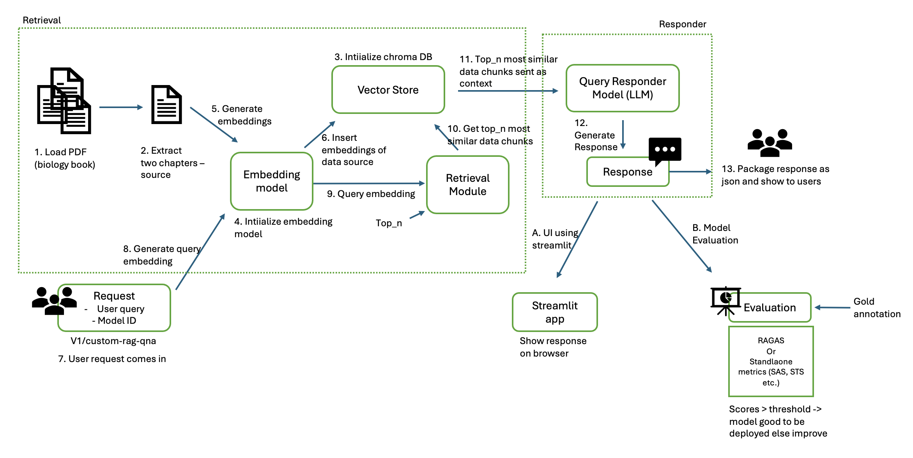
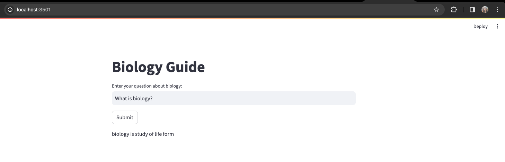

# Custom RAG Pipeline


A RAG pipeline built using open-source models for retrieving answers from specific sources. For this project, we use pdf
as our primary data source, `Llama-13b` as our query responder model and Sentence-Transformers `all-mpnet-base-v2` as embedding model. 

## Installation 


- Clone this repo 
- There are 2 ways to install:
  - You can install dependencies using by running following under project root directory, <br>
    ```
    pip install -r requirements.txt
    ```
  - You can install app by using Dockerfile present under project root directory (Disclaimer: Not comprehensively tested)


## Quick Start


### Architecture


Fig: High-level architecture of customized RAG pipeline. Here, Steps 1-13 indicate the overall flow of pipeline whereas 
A and B refer to additional steps that run independent offline.

### Assumptions
1. It is a non-conversational search system without any need for a memory buffer 
2. The only data source for this pipeline are the two chapters from biology book shared in assignment. Code currently supports
no other data loaders. 
3. All queries use same data source as data is indexed in vector store before requests start coming in
4. We use top-2 most similar document chunks as context to generate response
5. There is no need to validate/monitor filters such as client, user logged in state etc. 
6. We only have access to Llama-13b which is used as query responder model


### Input 
This pipeline takes in 2 arguments:
1. `user_query` (mandatory): query that user wants model to respond to 
2. `model_id` (optional): id of the model user wants this query to use for responding. We currently support only `llama-13b` and 
this field defaults to this model.
```
{
   "user_query": "What is biology"
   "model_id": "oss_llama-13b"
}
```

### Output
Pipeline outputs 3 fields as json object:
1. `response`: response from qa pipeline 
2. `user_query`: original user query
3. `answer_id`: a unique identifier for each request 
```
{
   "response": "Biology is the science that studies life, and life is characterized ...."
   "user_query": "what is biology",
   "answer_id": "f9828327823-2932-98239-23283283929329"
}
```


## Evaluation 


To build a comprehensive pipeline, we should ideally look at 3 kinds of metrics: 
1. Data Science (DS) metrics: such as relevancy, factual correctness etc.
2. Performance metrics: such as laetcny, throughput etc.
3. Cost analysis: overall cost in terms of resources etc.
However, due to time constraints, we primarily focus on DS metrics for this project. 

### 1. Metrics
We use four DS metrics to evaluate our pipeline: 
1. STS (Semantic Textual Similarity): Determines how similar cosine embeddings of generated and gold annotated responses are. Range: 0-1
2. SAS (Semantic Answer Similarity): Determines similarity score between a pair of generated and gold annotated responses. Range: 0-1
2. ROUGE-L (Recall-Oriented Understudy for Gisting Evaluation - Longest Common Subsequence (LCS)): Takes into account 
sentence-level structure similarity naturally and identifies longest co-occurring in sequence n-grams automatically. Range: 0-1
4. Weighted Metric - A weighted function of all previous response-level metrics. This metric gives highest max weightage 
to STS followed by equal weightage to SAS and ROUGE. These weights are chosen randomly and are subject to change based 
on findings.


### 2. How to evaluate?

To evaluate performance of our pipeline, upload test samples to `data/`. Ensure gold/silver answers for all queries 
are present under column `gold_answer` and queries are present under column `user_query`. Run the following under 
project root directory:
```
python eval.py --test_csv data/<name_of_testfile>
```

After this script completes, look out for an output csv `<name_of_testfile>_metrics.csv`  in same location. This file 
contains all of the above mentioned metrics for each query.

Note: Ensure flask backend is running before running evaluation script as qa responses are generated on the fly.


## Run UI using Streamlit


To run pipeline on browser, run the following under project root directory:
```
streamlit run streamlit_app.py
```

You will see UI similar to what shown below:


Note: Ensure flask backend is running before running streamlit UI.

## Issues & Potential Solutions

1. Library-based development: this pipeline primarily relies on Llamindex library for retrieval and responder implementation
which makes it hard to customize. We can use a local vector store to index all documents and use naive implementations of 
llama to customize prompt further. Sample prompt is added in code in `query_responder.py`.
2. Non-conversational pipeline: we could add memory buffer to make interaction more conversational wherein context from 
previously asked queries are also retained. We can implement this by using a database that retains last-k conversation
pairs. 
3. Limited context: <br>
   a. We use extremely limited data to generate response. This leads to lack of sufficient context for model to generate 
reliable responses and causes model to hallucinate more. We can use a larger dataset to make our pipeline qualitatively 
better. <br>
   b. We use top-2 most similar documents as context: this needs more experimentation with different configs
4. Limited metric tracking: <br> 
   a. Currently, we focus on DS metrics while cost analysis (in terms of resources) and performance (latecny, throughout etc.)
are equally important <br>
b. We can expand DS metric coverage by using frameworks like RAGAS and/or offline metrics (factual correctness, non-hallucination accuracy
etc)
5. Limited testing with Docker
6. Limited UI capability: Currently, there is a single button element. We can improve UI by adding session-level elements
to make it more interactive.
